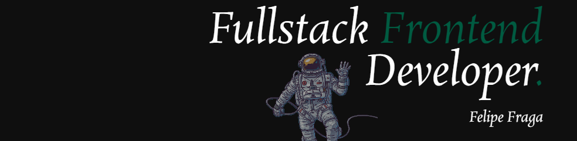

¡Hola! 

Soy un apasionado desarrollador fullstack dedicado a la creación de experiencias web excepcionales. Actualmente, soy estudiante de la Tecnicatura Universitaria en Programación en la Universidad CAECE y graduado fullstack del bootcamp 'Henry'. Mi búsqueda constante de conocimiento a través de la formación autodidacta me permite mantenerme actualizado y creativo frente a nuevos desafíos.
💡 Mi enfoque va más allá de la codificación; se trata de transformar ideas en soluciones innovadoras, aportando a equipos y buscando el mejor resultado.

🌐 Desarrollo Frontend:
- **Lenguajes y Bibliotecas:** JavaScript, TypeScript, React.
- **Manejo de Estado:** Redux, Redux Thunk, Redux Toolkit, Zustand.
- **Estilos y Diseño:** CSS, Tailwind, Bootstrap, HTML.

⚙️ Desarrollo Backend:
- **Entorno de Ejecución y Servidores:** Node.js, Express.
- **Base de Datos y ORM:** SQL, PostgreSQL, Sequelize (ORM para Node.js).

🛠️Herramientas:
- **Control de Versiones:** Git, GitHub.
- **Comunicación:** Slack, Discord.
- **Gestión de Proyectos:** Trello.
- **Diseño:** Figma.
- **Herramientas de Desarrollo:** Vite (bundler para desarrollo rápido).

## Portfolio 🚀
¡Puedo aportar conocimientos técnicos inmediatos a tu equipo! Echa un vistazo a mi [portfolio](https://felipe-fraga.vercel.app/).

## Contacto 📩
Siempre estoy abierto a nuevas conexiones y oportunidades de colaboración. No dudes en ponerte en contacto conmigo si tienes alguna pregunta o simplemente quieres conectar: felifraga10@gmail.com.

¡Gracias por visitar mi perfil! 😊

